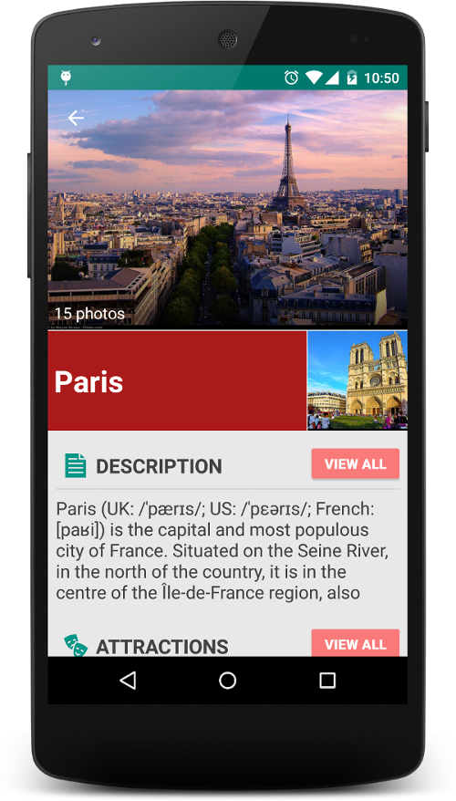
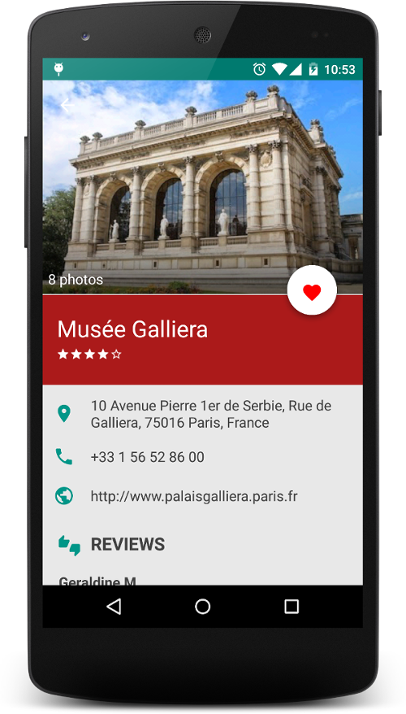

# Explore #

#### _Explore_ is a simple application that helps you find beautiful places to visit! ####

The way it works is very simple: you enter your wish, which might be a country, a city, or a location you would like to visit, and the app will return back a list of nice things about that place.

The data is pulled from several sources:
+ <b>Youtube</b> for videos
+ <b>Flickr</b> for photos
+ <b>Wikipedia</b> for description, and
+ <b>Google Places</b> for attractions (eg. museums, restaurants, etc)

        
        
        </img>

## Disclaimer ##
Please note that since the application uses data from different sources unrelated to each other, especially for a less known search term, the presented results sometimes might appear inconsistent. For example Google Places might return one thing, but the description returned by Wikipedia to relate to another thing. If you are going to make a decision based on the information provided by this app, always check if the provided information is correct.

## Libraries used ##
Some of the libraries used in this project are:
+ <a href="http://developer.android.com/training/volley/index.html" target="_blank">Volley</a> for making asynchronous HTTP calls and image loading
+ <a href="https://github.com/greenrobot/EventBus" target="_blank">EventBus</a> for communicating between different layers
+ <a href="https://github.com/JakeWharton/butterknife" target="_blank">ButterKnife</a> for view injection
+ <a href="http://developer.android.com/reference/android/support/v7/graphics/Palette.html" target="_blank">Palette</a> for extracting prominent colors from an image

## Building the project ##
In order to successfully build the project a few API keys have to be provided (<a href="https://www.flickr.com/services/apps/create/apply/" target="_blank">Flickr</a>, <a href="https://developers.google.com/youtube/v3/getting-started" target="_blank">Youtube</a>, <a href="https://developers.google.com/places/android-api/signup" target="_blank">Google Places</a>). 
The API keys are expected to be defined in a file called <b>keys.propreties</b> located in the project's root directory.

<b><i>Explore/keys.properties</i></b>
<pre>
places_api_key=[your api key]
youtube_api_key=[your api key]
flickr_api_key=[your api key]
</pre>

License
-------

    Copyright 2015 - 2016 Veaceslav Grec

    Licensed under the Apache License, Version 2.0 (the "License");
    you may not use this file except in compliance with the License.
    You may obtain a copy of the License at

        http://www.apache.org/licenses/LICENSE-2.0

    Unless required by applicable law or agreed to in writing, software
    distributed under the License is distributed on an "AS IS" BASIS,
    WITHOUT WARRANTIES OR CONDITIONS OF ANY KIND, either express or implied.
    See the License for the specific language governing permissions and
    limitations under the License.

